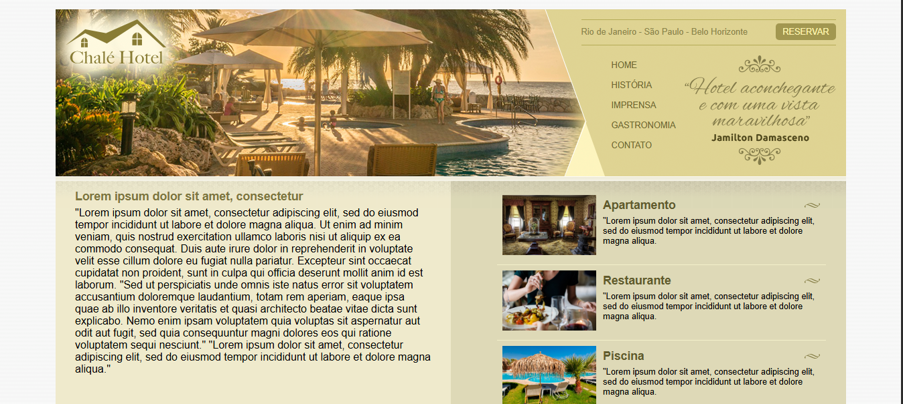

<h2 id="sobre-o-projeto">1. 🏨 Chalé Hotel: Landing Page Institucional 🏨</h2>


[](https://github.com/Domisnnet/chale-hotel/blob/main/LICENSE)



Bem-vindo ao projeto **Chalé Hotel**! Este repositório apresenta uma interface elegante e funcional para uma rede de hotéis com presença nas principais capitais brasileiras. O foco aqui foi criar um layout limpo, utilizando técnicas de posicionamento CSS para separar o conteúdo principal dos benefícios laterais, proporcionando uma navegação intuitiva para o hóspede.

---

## 📚 Tabela de Conteúdo

| 🏨 O Projeto | 🛠️ Técnico | 🤝 Comunidade |
| :---: | :---: | :---: |
| [](#sobre-o-projeto) | [](#destaques-tecnicos) | [](#codigo-fonte) |
| [](#tecnologias-utilizadas) | [](#instalacao) | [](#créditos) |
| [](#como-acessar) | [](#como-contribuir) | [](#licenca) |
| [](#funcionalidades) | [](#faq) | [](#perfil-do-github) |

---

<h2 id="tecnologias-utilizadas">2. ⚙️ Tecnologias Utilizadas</h2>

| Camada | Tecnologias | Descrição |
| :--- | :--- | :--- |
| **Estrutura** |  | Organização em blocos (`divs`) para topo, menus e áreas de conteúdo. |
| **Estilo** |  | Implementação de layouts em colunas e estilização de navegação. |
| **UI/UX** |  | Tipografia e paleta de cores voltadas para o setor de hotelaria. |

---

<h2 id="como-acessar">3. 🚀 Como Acessar</h2>

Visualize a estrutura do site do hotel diretamente no seu navegador:

<div align="left">
  <a href="https://domisnnet.github.io/Chalet-Hotel-Web-Essentials/" target="_blank">
    
  </a>
</div>

---

<h2 id="funcionalidades">4. 🧩 Funcionalidades Principais</h2>

A página foi construída para simular um portal de hotelaria completo:

| Funcionalidade | Descrição |
| :--- | :--- |
| 🧭 **Menu de Navegação** | Acesso rápido a Home, História, Gastronomia e Contato. |
| 📅 **Botão de Reserva** | Call-to-action (CTA) destacado para facilitar a conversão de hóspedes. |
| 📍 **Locais de Atuação** | Exibição clara das cidades atendidas pela rede. |
| 🛌 **Vitrine de Serviços** | Área lateral destacando Apartamentos, Restaurantes e Lazer (Piscina). |
| 💬 **Depoimentos** | Espaço reservado para validação social de clientes satisfeitos. |

---

<h2 id="destaques-tecnicos">5. 💻 Destaques Técnicos</h2>


O desenvolvimento focou na organização semântica e na estética:

### 📐 Estrutura de Divisões
O projeto utiliza um `container` mestre que agrupa o `topo`, `area-principal` e `area-lateral`, garantindo que o layout permaneça centralizado e organizado mesmo em telas maiores.

### 🔄 Técnica de Sidebar
A separação entre `#area-principal` e `#area-lateral` foi pensada para priorizar a leitura do conteúdo institucional à esquerda, enquanto mantém os benefícios visuais e comerciais acessíveis à direita.

---

<h2 id="instalacao">6. 🚀 Instalação e Configuração Local</h2>

Explore a organização dos arquivos de estilo e imagens:

```bash
# Clonar o repositório
git clone https://github.com/Domisnnet/Chalet-Hotel-Web-Essentials.git(https://github.com/Domisnnet/Chalet-Hotel-Web-Essentials.git)

# Acessar a pasta
cd Chalet-Hotel-Buzz-Web-Essentials
```

---

<h2 id="como-contribuir">7. 🤝 Como Contribuir</h2>

Siga os passos abaixo para fortalecer este projeto:

| Fase | Ação | Link / Comando |
| :---: | :--- | :--- |
| **01** | **Fork** | [](https://github.com/Domisnnet/Chalet-Hotel-Web-Essentials/fork) |
| **02** | **Branch** | `git checkout -b feature/NovoTemaCores` |
| **03** | **Commit** | `git commit -m 'feat: alteração para paleta dark mode'` |
| **04** | **Push** | `git push origin feature/NovoTemaCores` |
| **05** | **PR** | [](https://github.com/Domisnnet/Chalet-Hotel-Web-Essentials/compare)

### 🐛 Encontrou um problema?
Se algo não estiver funcionando como esperado, não hesite em abrir um chamado:

[](https://github.com/Domisnnet/Chalet-Hotel-Web-Essentials/issues)
[](https://github.com/Domisnnet/Chalet-Hotel-Web-Essentials/issues/new)

---

<h2 id="faq">8. 🧠 Perguntas Frequentes</h2>

<details>
<summary><strong>O site é responsivo ❓</strong></summary>
<p>📱 <strong>Resposta:</strong> Este projeto foi construído inicialmente como um layout fixo para estudos de posicionamento. A adaptação para dispositivos móveis via Media Queries está prevista para futuras atualizações.</p>
</details>

<details>
<summary><strong>Como altero as fotos dos quartos ❓</strong></summary>
<p>📸 <strong>Resposta:</strong> Basta substituir os arquivos na pasta <code>imagens/</code> ou alterar os caminhos nas tags <code>&lt;img&gt;</code> dentro da lista de benefícios na área lateral.</p>
</details>

<details>
<summary><strong>O botão de reservar já funciona ❓</strong></summary>
<p>🔗 <strong>Resposta:</strong> Atualmente ele funciona como um link âncora. Para torná-lo funcional, seria necessário integrá-lo a um sistema de reservas ou formulário de contato.</p>
</details>

---

<h2 id="codigo-fonte">9. 💻 Código Fonte</h2>

Analise a estrutura HTML e as regras de estilização CSS:


[](https://github.com/Domisnnet/Chalet-Hotel-Web-Essentials)

---

<h2 id="créditos">10. 📝 Créditos & Reconhecimentos</h2>

Este projeto foi construído para simular um ambiente de hotelaria real:

| Atribuição | Responsável / Recurso | Descrição |
| :--- | :--- | :--- |
| **Dev & Design** | **DomisDev** | Implementação técnica da estrutura HTML e estilização CSS. |
| **Assets Visuais** | **Google Images** | Imagens ilustrativas para Apartamentos, Restaurantes e Lazer. |
| **Base Teórica** | **Web Standards** | Boas práticas de estruturação de layouts institucionais. |
| **Apoio Técnico** | **Google Gemini** | Auxílio na padronização documental para o padrão King-Domfy. |

### 🎯 Missão do Projeto
> "Demonstrar a importância da hierarquia visual e da separação de áreas de conteúdo para sites que buscam converter visitantes em clientes, unindo informação e call-to-actions estratégicos."

---

<h2 id="licenca">11. 📄 Licença</h2>

Este projeto está licenciado sob a [](https://github.com/Domisnnet/Chalet-Hotel-Web-Essentials/blob/main/LICENSE)

---

<h2 id="perfil-do-github">12. 👨‍💻 Perfil do GitHub</h2>

<a href="https://github.com/Domisnnet"> 
   
</a>
